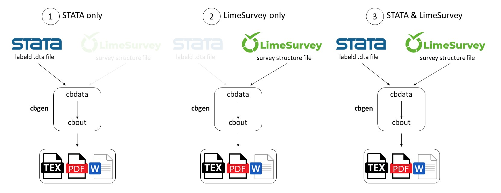

# Stata Codebook Generator

### Idea
Use this Stata ado to automatically create a codebook in multiple output formats from:
1. a (labeled) Stata dataset
2. a LimeSurvey structure file
3. both data sources to get the most comprehensive output

Just use the `cbgen` command if you need it quick and easy. Depending on the input file(s), you will get a codebook with slightly different informations in the selected output format. Use the included `cbdata` and `cbout` commands separately if you want to add additional information or make changes.

The Stata data set provides on the one hand simple informations about variables, values (and labels). On the other hand it's possible to use informations about number of observations and statistics.
The LimeSurvey survey file contains more detailed information about the question type and text, hint, filters, question groups and input limits.

### Install
- not published via ssc for now
- manualy install by downloading and copy all files to personal ado folder (check path with stata command `sysdir`)

### Howto
 ...

### Version
0.1 - 15.12.2021

### Acknowledgment
- [Lena Hipp](https://www.wzb.eu/de/personen/lena-hipp) for the time and motivation
- [Adam Reiner](https://www.wzb.eu/de/personen/adam-reiner) for interest and support

### Upcoming
- check for different versions
- include condition manager
- rename of variables -> read dofile
- panel
